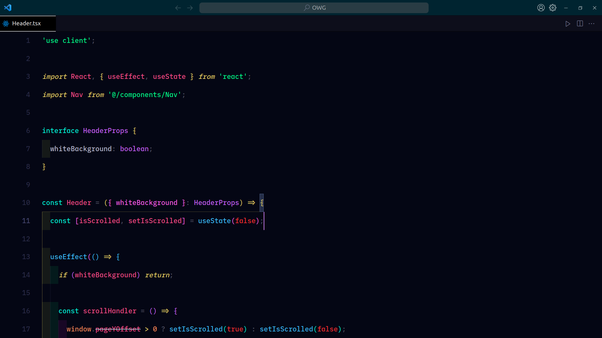

# Attentio Theme 

Elevate your coding sessions with the Attentio theme. Its dark, cool-toned palette and meticulously chosen token colors not only soothe the eyes but also bolster readability and focus, crafting an aesthetic that keeps your attention sharp.

## Features

- **Dark Theme**: A soothing dark background to reduce eye strain during long debugging sessions.
- **Cool-Toned Colors**: A color palette that is easy on the eyes, helping you focus on solving problems.
- **Syntax Highlighting**: Custom token colors designed to make code more readable and error tracking a breeze.

## Attentio - Dark Theme


## Recommended Font Settings

```json
  "editor.fontFamily": "'Lilex'",
  "editor.fontLigatures": "'calt', 'ss02', 'zero', 'cv01', 'cv08', 'cv09'",
  "editor.fontSize": 15,
  "editor.lineHeight": 40,
  "window.zoomLevel": 2,
  "editor.fontWeight": "500",
  "editor.letterSpacing": 0.1,
```

**Happy Coding!**
